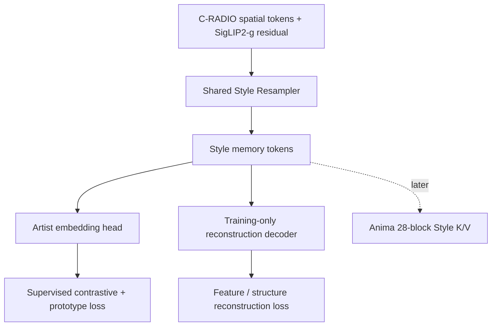

# Anima Style Adapter: 1차 데이터·표현 학습 계획

- 문서 상태: 사전 계획 / 실험 전
- 작성일: 2026-08-09
- 1차 목표 규모: 작가 5,000명 × 작가당 최종 이미지 30장 = 150,000장

## 1. 목표와 범위

Danbooru 메타데이터에서 충분한 이미지가 있는 작가를 선별하고, 업로드 시점이 비교적 가까운 이미지 30장을 작가별로 구성한다. 이미지에는 WD EVA02 Tagger를 적용하고, C-RADIOv4-SO400M의 공간 특징과 SigLIP2-g adaptor에서 얻은 content-subtracted 특징을 입력으로 삼아 Style Resampler를 학습한다.

Resampler는 하나의 공통 경로에서 다음 두 목적을 동시에 학습한다.

1. 같은 작가의 이미지가 유사한 스타일 공간에 놓이도록 하는 작가 비교대조·프로토타입 학습
2. 입력 이미지의 유용한 시각 특징과 구조가 잠재표현에 남도록 하는 encoder-decoder 재구성 학습

재구성 decoder는 표현 학습에만 사용하며, 실제 Style Transfer 추론에서는 제거한다. Resampler 표현이 검증된 뒤 Anima의 28개 block에 연결할 Style Adapter K/V 구조와 전체 크기를 확정한다.

## 2. 현재 확정한 사항

| 항목 | 결정 |
|---|---|
| 메타데이터 | `Shio-Koube/Danbooru-2026-parquet-metadata` |
| 1차 데이터 규모 | 5,000 artists × 30 images = 150,000 images |
| 시간 정보 | 원본 publication 시점이 아니라 Danbooru의 `created_at`을 사용 |
| 작가별 시간 제약 | 한 작가의 표본이 일정한 업로드 날짜 범위 안에 있도록 제한 |
| 최신성 | 최근 작가·최근 이미지에 더 높은 표집 가중치 부여 |
| 중복 제거 | 정확 중복 및 거의 중복 이미지만 빠르게 제거 |
| 스타일 필터링 | 이미지 임베딩에 의한 스타일 유사도 검사·군집화는 1차 학습에서 하지 않음 |
| 태거 | `ashen-sensored/wd-eva02-tagger-2026-canary` |
| 비전 인코더 | `nvidia/C-RADIOv4-SO400M` |
| 시각 입력 | 16의 배수인 비정사각 해상도와 다양한 종횡비 사용 |
| 특징 입력 | SigLIP2-g content-subtracted 특징 + C-RADIO backbone 공간 특징 |
| 레이어 선택 | 실제 데이터 수집 뒤 probe 실험으로 결정 |
| 표현 학습 | 단일 Resampler 경로에 작가 임베딩 loss와 재구성 loss를 함께 적용 |
| 추론 | 재구성 decoder는 사용하지 않음 |
| 작가 split | 기본안 95% train / 2.5% validation / 2.5% test |
| 학습 작가의 이미지 역할 | 고정 reference/target이 아니라 step마다 동적으로 교대 |

## 3. 단계별 파이프라인

```mermaid
flowchart LR
    A["Danbooru Parquet metadata"] --> B["Metadata filtering"]
    B --> C["Artist/date-window sampling"]
    C --> D["Candidate image download"]
    D --> E["Exact + near-duplicate removal"]
    E --> F["Final 5,000 × 30 manifest"]
    F --> G["WD EVA02 tagging"]
    F --> H["Aspect-preserving preprocessing"]
    G --> I["Content caption"]
    H --> J["C-RADIO backbone features"]
    H --> K["SigLIP2-g visual features"]
    I --> L["SigLIP2-g text features"]
    K --> M["Content subtraction"]
    L --> M
    J --> N["Layer/feature probes"]
    M --> N
    N --> O["Resampler size and structure decision"]
    O --> P["Joint artist embedding + reconstruction training"]
    P --> Q["Anima 28-block K/V adapter training"]
```



### 3.1 남은 작업의 간단한 순서

1. RunPod에서 5,000명 × 30장을 수집하고 태깅·caption까지 생성한다.
2. 소규모 probe subset으로 C-RADIO 중간 레이어를 비교한 뒤 사용할 특징만 확정한다.
3. 확정된 특징을 전체 데이터에 캐싱하고, 단일 경로의 Style Encoder와 학습 전용 decoder를 훈련한다.
4. 1~8장 set 입력을 처리하는 multi-reference cross-attention을 훈련한다.
5. Anima의 실제 28개 block 형상을 확인하여 block별 Style K/V를 연결하고 생성 loss로 훈련한다.
6. seen/unseen artist와 reference 수별 평가 후 구조와 loss를 조정한다.

## 4. 메타데이터 스캔과 작가 선별

원본 데이터셋은 약 1,060만 행이므로 전체를 메모리에 올리지 않는다. Polars lazy scan, DuckDB 또는 PyArrow dataset scanner로 필요한 컬럼만 읽고, 메타데이터 단계의 저비용 필터를 먼저 수행한다.

필요한 주요 컬럼은 다음과 같다.

- 식별·시간: `id`, `created_at`, `md5`
- 작가: `tag_string_artist`, `tag_count_artist`
- 중복 단서: `tag_string_meta`, `parent_id`, `source`, `pixiv_id`
- 다운로드: `file_url`, `large_file_url`, `original_url`, `file_ext`, `file_size`
- 이미지: `image_width`, `image_height`
- 상태: `is_deleted`, `is_banned`, `is_flagged`, `is_pending`
- 태그: `tag_string_general`, `tag_string_character`, `tag_string_copyright`, `tag_string_meta`

초기 기본안은 다운로드 가능한 정상 이미지와 단일 작가 태그가 있는 행을 우선하는 것이다. 다중 작가 작품, rating, 지원 확장자, 삭제·flag 상태의 정확한 포함 정책은 데이터 분포를 집계한 뒤 설정 파일에 명시한다.

### 4.1 작가별 시간 창

`created_at`은 작품 공개일이 아닌 Danbooru 업로드일이다. 따라서 이것을 화풍 시기의 완전한 증거로 간주하지 않고, 이용 가능한 시간 근사치로만 사용한다.

작가별 후보를 `created_at`순으로 정렬한 뒤, 최종 30장과 중복 제거 여유분을 확보할 수 있는 연속 시간 창을 찾는다. 가능한 창이 여러 개라면 더 최근인 창을 우선한다. 정확한 `date_window_days`는 분포를 확인해 결정한다. 고정된 창 하나로 충분한 작가가 크게 줄어들 경우에는 다음 순서로 완화한다.

1. 기본 시간 창 안에서 충분한 작가 선별
2. 부족한 작가에 한해 창을 단계적으로 확대
3. 확대된 실제 창 길이를 manifest에 기록

### 4.2 최신성 가중 표집

최신 이미지가 다수를 차지하도록 작가 선택과 작가 내부 이미지 선택에 별도의 최신성 가중치를 둘 수 있다. 초기 후보식은 다음과 같으며, 감쇠 상수는 데이터 분포를 보고 정한다.

```text
w_artist(a) = exp(-(T_snapshot - t_recent(a)) / tau_artist)
w_image(i|a) = exp(-(t_recent(a) - t_i) / tau_image)
```

- `T_snapshot`: 데이터셋 기준 시점
- `t_recent(a)`: 해당 작가 후보 중 가장 최근 업로드 시점
- `t_i`: 이미지 업로드 시점
- `tau_artist`, `tau_image`: 아직 미정인 감쇠 상수

동일한 설정과 seed로 결과를 재생성할 수 있어야 한다. 작가당 처음부터 30장만 내려받지 않고, 다운로드 실패와 near-duplicate 제거를 감안한 후보 배수를 먼저 뽑는다. 후보 배수는 소규모 측정 후 결정한다.

### 4.3 작가 split과 작가 내부 이미지 split

작가 일반화와 같은 작가의 미관측 이미지 일반화를 혼동하지 않도록 두 축을 모두 분리한다.

**작가 단위 split**의 기본안은 5,000명 중 4,750명(95%)을 train, 125명을 validation, 125명을 test로 고정하는 것이다. Validation/test 작가는 Style Encoder와 Anima K/V 학습에 전혀 사용하지 않는다.

**이미지 단위 split**도 각 작가 안에서 별도로 둔다.

- Train 작가: 기본안은 30장 중 27장을 동적 학습 pool, 3장을 seen-artist held-out target으로 둔다.
- Validation/test 작가: 최대 8장을 고정 reference pool, 나머지 22장을 target pool로 두고 1/2/4/8장 reference 조건을 같은 target에 비교한다.
- 정확한 장수는 manifest 통계를 본 뒤 설정으로 조정하되 split seed와 이미지 ID는 고정한다.

Train 작가의 27장 학습 pool 안에서는 reference와 target을 고정하지 않는다. 매 step 한 이미지를 target으로 뽑고 나머지 이미지 중 1~8장을 reference로 뽑으므로, 모든 이미지가 학습 중 reference와 target 역할을 번갈아 맡는다. 일반 단계에서는 target과 reference가 서로 다른 이미지여야 하며 near-duplicate도 함께 배제한다. 초기 self-reference curriculum을 사용할 때만 설정된 확률로 target을 reference 집합에 의도적으로 포함하고, 그 비율을 점차 0에 가깝게 낮춘다.

고정 held-out 이미지는 이러한 역할 교대에 넣지 않는다. 이는 seen-artist 평가에서 학습에 사용되지 않은 target을 보장하기 위한 것이다. Unseen validation/test 작가의 reference와 target 역시 학습에 들어가지 않는다.

## 5. 빠른 중복 및 near-duplicate 제거

1차 데이터셋에서는 스타일 유사도를 검사하지 않는다. 중복 제거는 다음의 저비용 계층으로 제한한다.

### 5.1 메타데이터 단계

1. 동일 `md5`는 전역 exact duplicate로 묶는다.
2. `tag_string_meta`의 `duplicate`, `pixel-perfect_duplicate` 표식을 중복 단서로 사용한다.
3. 정규화된 동일 source URL을 보조 단서로 사용할 수 있다.
4. 동일 `pixiv_id`만으로 제거하지 않는다. 다중 페이지 게시물은 서로 다른 이미지일 수 있기 때문이다.

### 5.2 다운로드 뒤 이미지 단계

최종 후보 풀에 대해서만 작은 정규화 thumbnail의 64-bit pHash/dHash 또는 wHash를 계산한다. 모든 이미지 쌍을 비교하지 않고 hash prefix bucket, BK-tree 또는 LSH로 가까운 후보만 찾는다. 경계 사례에 한해 작은 thumbnail SSIM으로 확인할 수 있다.

첫 실험의 perceptual near-duplicate 검사는 기본적으로 작가 내부에서 수행한다. 전역 near-duplicate 제거는 재업로드나 작가 태그 오류를 잡을 수 있지만 공동 작업·재가공 이미지를 잘못 제거할 위험이 있으므로 별도 실험 항목으로 둔다.

Hash 거리와 SSIM 임계값은 소규모 수동 감사 표본으로 보정한다. 제거 시에는 `removed_id`, `kept_id`, 제거 이유, hash 거리 및 확인 점수를 기록한다. 대표 이미지는 최신성, 해상도, 다운로드 상태를 이용한 고정 규칙으로 선택하되 정확한 우선순위는 데이터 조사 후 확정한다.

## 6. 다운로드와 이미지 전처리

C-RADIOv4-SO400M은 patch size 16이며, 16 단위의 비정사각 해상도를 처리할 수 있다. 따라서 정사각형 강제 변환을 피하고 원본 종횡비를 최대한 보존한다.

전처리 원칙은 다음과 같다.

1. EXIF orientation을 적용하고 입력 색상 및 alpha 처리 방식을 고정한다.
2. 이미지가 token/pixel 예산보다 클 때만 종횡비를 유지해 축소한다.
3. 축소 후 각 변을 16의 배수인 지원 해상도에 맞춘다.
4. padding을 기본값으로 삼지 않고, 원본 비율과 가장 가까운 크기가 되도록 최소 영역만 결정적으로 crop한다.
5. 임의 square crop은 하지 않는다.
6. 작은 이미지는 특별한 이유가 없으면 확대하지 않는다. 16 배수 정렬에 필요한 최소 crop 정책을 사용한다.
7. resize 크기, interpolation, crop box와 최종 해상도를 manifest에 기록한다.

`max_long_side` 또는 `max_pixels`, crop anchor, interpolation 방식은 품질·처리량·feature cache 크기를 측정한 뒤 고정한다. C-RADIO 특징을 사전 계산할 것이므로 cache용 기본 view는 결정적이어야 한다. 학습 augmentation이 필요하다면 cache 설계와 함께 별도로 정한다.

## 7. WD EVA02 태깅과 content caption

최종 150,000장 전체를 지정한 WD EVA02 Tagger로 batch inference한다. 현재 링크는 Hugging Face Space이므로, 본 처리 전에 다음을 반드시 고정한다.

- Space 또는 실제 model artifact의 revision
- 전처리 해상도와 normalization
- tag vocabulary revision
- general/character 임계값과 정렬 규칙
- batch runtime 및 backend

최종 문자열만 저장하지 않고 가능한 경우 각 태그의 원시 확률 또는 logit도 함께 저장한다. 그러면 이미지 재추론 없이 threshold와 caption 규칙을 바꿀 수 있다.

Content caption은 이미지의 내용을 설명하되 작가 정체성과 직접적인 스타일 누출을 줄이는 방향으로 만든다. 기본적으로 general, character, copyright 계열의 내용 태그를 후보로 사용하고, artist 태그와 스타일·품질·메타 성격의 태그는 제거한다. 정확한 allow/deny 목록은 태거 출력 분포를 확인한 뒤 버전 관리한다.

## 8. C-RADIO와 SigLIP2-g 특징 구성

C-RADIOv4-SO400M은 backbone의 summary/spatial 특징과 `siglip2-g` teacher adaptor 출력을 함께 제공한다. 또한 intermediate layer 출력을 얻을 수 있으므로, 다음 두 계열을 Resampler 후보 입력으로 둔다.

1. C-RADIO backbone의 공간 토큰: 선, 질감, 형태, 배치 등 국소·공간 구조 보존
2. SigLIP2-g의 image 특징에서 content-caption text 특징을 뺀 residual: 내용 성분을 약화한 전역 후보 특징

초기 residual 정의는 다음과 같다.

```text
s_visual = normalize(siglip2_g_image)
s_text   = normalize(siglip2_g_text(content_caption))
s_resid  = normalize(s_visual - lambda_content * s_text)
```

`lambda_content=0`인 subtraction 없는 기준선부터 여러 값을 비교한다. 단순 벡터 subtraction이 곧 스타일 분리를 보장하지는 않으므로, residual의 작가 검색 성능과 content leakage를 함께 측정한다.

SigLIP2-g summary의 차원, backbone spatial token의 차원과 선택 레이어가 다를 수 있으므로 각각 projection한 뒤 Resampler에 제공한다. 이때 content residual과 공간 특징을 별도 네트워크로 분기해 서로 경쟁시키지 않고, 동일한 Resampler memory를 만드는 하나의 경로 안에서 결합한다.

## 9. 사용할 C-RADIO 레이어 결정

전체 150,000장에 여러 레이어 특징을 모두 저장하기 전에 pilot subset으로 probe한다. 후보 비교는 다음 정도로 제한한다.

- 최종 레이어만 사용
- 얕은·중간·깊은 레이어를 소수 선택한 sparse multi-layer 입력
- 여러 레이어의 learned weighted mixture
- backbone 공간 특징 단독
- SigLIP2-g residual 단독
- 공간 특징 + residual 결합

중간 레이어 번호는 사전에 확정하지 않는다. C-RADIO 실제 block 수와 출력 텐서를 확인한 뒤 균등한 깊이의 몇 지점을 후보로 삼는다. 선택 기준은 다음과 같다.

- held-out 이미지의 작가 retrieval / prototype 분류
- decoder의 구조·특징 재구성 품질
- content/character/copyright를 예측하는 leakage probe
- 이미지당 cache 크기와 처리량
- 동일 작가 내 안정성과 서로 다른 작가 간 분리도

레이어 선택 후에만 전체 데이터 특징 cache를 생성한다. 그렇지 않으면 다중 레이어 공간 토큰 때문에 저장공간이 불필요하게 커진다.

## 10. Resampler 표현 학습

### 10.1 단일 공통 경로



한쪽 경로가 비활성화되는 것을 피하기 위해 style용 encoder와 reconstruction용 encoder를 따로 두지 않는다. 하나의 Style Resampler가 만든 memory token을 두 loss가 함께 제약한다.

초기 목적함수는 다음 형태로 둔다.

```text
L_repr = lambda_rec   * L_reconstruction
       + lambda_con   * L_supervised_contrastive
       + lambda_proto * L_prototype
```

- `L_reconstruction`: backbone 공간 특징 또는 선택한 시각 target의 복원
- `L_supervised_contrastive`: 같은 작가의 서로 다른 이미지를 positive로 사용
- `L_prototype`: 작가별 prototype 주변으로 표현을 모음

Loss 가중치, decoder target, memory token 수, hidden dimension, Resampler depth는 feature probe 뒤 정한다. 원본 publication 시점과 실제 스타일 시기가 없고 스타일 유사도 필터도 하지 않으므로, 1차 실험에서는 작가당 하나의 prototype을 둔다는 가정을 유지하되 결과 해석 시 label noise를 고려한다.

### 10.2 여러 reference 지원

Resampler는 1~8개의 reference 이미지가 들어올 수 있도록 set 입력을 지원해야 한다. 이미지 순서에 과도하게 의존하지 않게 이미지별 표시와 permutation augmentation 또는 permutation-invariant aggregation을 검토한다.

표현 학습 초기에는 single-image reconstruction도 유지하여 각 이미지의 유용한 정보가 사라지지 않게 한다. 동시에 같은 작가의 서로 다른 이미지들을 묶어 만든 memory가 안정적인 작가 embedding을 갖도록 학습한다. Reference 수가 1, 2, 4, 8일 때의 retrieval·재구성·최종 생성 품질 곡선을 별도로 측정한다.

## 11. Anima Style Adapter로의 연결

Resampler의 표현과 규모가 정해진 뒤 Anima의 28개 block 각각에 Style Adapter용 K/V projection을 추가한다. 이 단계의 기본 학습 샘플은 같은 작가의 reference 1~8장, target의 content prompt, target 이미지로 구성한다.

정확한 target 이미지를 reference로 장기간 사용하는 것은 내용·구도 복사 shortcut을 만들 수 있다. 따라서 self-reference는 필요할 경우 초반 5% 이내의 짧은 warm-up에서만 강한 augmentation과 함께 사용하고, 전체 학습의 10% 이전에 제거한다. 이후에는 매 episode 안에서 reference와 target을 분리하되, train pool의 이미지들은 episode마다 두 역할을 번갈아 맡을 수 있다.

Decoder는 이 표현 학습의 보조 장치이므로 최종 Style Transfer 추론 경로에는 포함하지 않는다.

### 11.1 Multi-reference와 block별 Style K/V

각 reference는 공유된 per-reference Resampler를 거쳐 `N×D` style token을 만든다. 1~8장분의 token은 순서에 무관한 작은 Set Aggregator가 받아 고정된 수의 최종 style token으로 합친다. 28개의 독립 aggregator를 두지 않고 하나의 aggregator를 공유한다.

확정한 per-reference 입력은 **C-RADIO L18 spatial + L24 spatial + L24 내부 SigLIP teacher CLS**다. L18/L24의 같은 위치 spatial token을 각각 정규화한 뒤 채널 방향으로 결합하고 2-layer MLP로 768차원에 투영한다. L24 SigLIP CLS는 별도 768차원 global context token으로 투영해 spatial context 앞에 추가한다. 16개의 learned query와 4-layer cross/self-attention Resampler가 reference마다 `16×768` style token을 출력한다. 보조 256차원 projection에만 작가 loss를 걸지 않고, 대응하는 16개 출력 slot 자체에 slot-wise prototype loss를 적용한다. 2-layer reconstruction decoder는 L18/L24 spatial 특징을 복원하며 추론에서는 제거한다.

Set Aggregator는 입력 `B×R×16×768`에서 같은 번호의 slot끼리 reference 방향 attention을 먼저 수행한다. masked mean을 residual 기준으로 삼고 attention branch에는 `1e-3` LayerScale을 사용해 1-reference에서 원래 출력에 가깝게 시작한다. 이후 2-layer, 12-head Pre-LN slot Transformer로 16개 slot 사이를 정제하고 reference 수와 무관한 `16×768`을 출력한다. Reference 순서 embedding은 사용하지 않는다. 전체 style dropout에서는 같은 형상의 learned null token을 사용한다.

초기 고정값은 다음과 같다.

- per-reference/final style tokens: 16
- token width: 768
- Resampler heads: 12, encoder 4 layers, training-only decoder 2 layers
- Set Aggregator: reference-slot attention 1 layer + slot Transformer 2 layers
- 개별 slot prototype loss + 약한 pooled prototype loss
- Anima K/V shared full-rank base + block별 rank-16 delta

Anima 28-block 모델은 hidden dimension 2,048, 16-head 구조이며 각 block이 AdaLN으로 조절되는 self-attention, text cross-attention, MLP를 순서대로 수행한다. Style 조건은 text token과 같은 softmax에 단순 연결하지 않고 별도의 decoupled style-attention branch로 추가한다. Style branch는 기존 text cross-attention에 들어가는 정규화된 image hidden state와 block별 `Q` projection을 재사용하고 style K/V만 새로 만든다. 1차 구현에서는 기존 output projection도 재사용하며, 별도 style Q 또는 Q-LoRA는 이 구조의 한계가 실제 생성 평가에서 확인될 때만 검토한다.

Style attention은 text cross-attention 직후, MLP 이전에 삽입한다. 따라서 text와 style은 서로 다른 softmax로 조건을 읽되, 두 residual이 합쳐진 hidden state를 같은 block의 MLP가 처리한다. Text token과 style token을 한 attention의 K/V로 concatenate하지 않는다.

`x_text = x + A_text(Q(x), K_text, V_text)`

`x_style = x_text + strength * g_b(t) * A_style(Q(x), K_style, V_style)`

`x_out = x_style + MLP(x_style)`

Style K/V projection은 모든 block이 공유하는 full-rank base와 block별 low-rank delta로 구성한다.

`W_b = W_shared + A_b B_b`

초기 후보 rank는 16과 32이다. Style gate는 Anima timestep embedding을 받는 작은 shared MLP가 28개의 block별 scalar를 출력하는 구조를 1차 기준으로 삼는다. 마지막 projection만 0으로 초기화하여 학습 시작 시 원본 Anima와 같은 출력을 보장하고, 두 개의 0-init 인자를 곱해 gradient가 막히는 구조는 사용하지 않는다. Channel별 gate는 scalar gate의 한계가 확인될 때만 low-rank 형태로 검토한다.

사용자 `strength`는 style token이나 K/V 입력이 아니라 style-attention residual에 곱한다. 입력 token을 스케일하면 K 크기와 softmax 분포까지 비선형적으로 변하므로 피한다.

### 11.2 Null token, style dropout과 Style CFG

Set Aggregator의 최종 출력과 같은 형상 `M×D`의 전역 learned null token을 둔다. 이는 reference가 없는 상태를 나타내며 zero tensor나 회색 이미지 encoding을 기본 null 표현으로 사용하지 않는다. 학습 episode의 10~15%에서는 전체 reference set을 null token으로 교체하여 style branch가 있거나 없는 두 경로를 모두 학습한다. 별도의 reference별 dropout과 reference-count dropout으로 1/2/4/8장 조건도 함께 견고하게 만든다.

Text와 style의 강도는 다음 세 prediction으로 분리한다.

`v = v_uncond + s_text * (v_text - v_uncond) + s_style * (v_text_style - v_text)`

- `v_uncond`: text와 style 모두 unconditional
- `v_text`: text만 사용하고 style은 null
- `v_text_style`: text와 실제 style을 모두 사용

이를 통해 prompt CFG와 Style CFG를 독립적으로 조절한다. 구현 시 세 condition을 batch로 묶을지 별도 pass로 실행할지는 VRAM과 처리속도를 측정해 정한다. Adapter를 완전히 끄는 경로에서는 style gate를 명시적으로 0으로 만들어 원본 Anima 동작을 보장한다.

### 11.3 동결 및 공동학습 순서

1. C-RADIO를 계속 동결하고 per-reference Resampler를 reconstruction과 직접적인 slot-wise artist prototype loss로 사전학습한다.
2. Style Adapter 연결 초기 5~10% 구간에는 Resampler와 Anima를 동결하고 Set Aggregator, shared K/V base, block별 low-rank delta와 style gate만 학습한다.
3. Style branch가 안정화되면 Resampler 상위 1~2층만 Adapter 학습률의 5~10%로 해제한다. 이때 prototype loss와 사전학습 출력에 대한 anchor loss를 유지하여 style 공간의 붕괴와 content leakage를 억제한다.
4. 검증 성능 향상이 없으면 Resampler를 다시 동결한다. Anima 본체는 기본적으로 동결하며, Adapter만으로 한계가 확인될 때에만 기존 cross-attention Q/output projection에 작은 LoRA를 검토한다.

C-RADIO는 전 단계에서 동결한다. 공동학습 중 reconstruction decoder 비용이 크면 decoder는 제외하고 prototype 및 anchor loss만 유지할 수 있다.

## 12. 캐시와 산출물

최종 feature contract가 정해졌으므로 pilot 10,000장만 별도 캐싱하지 않는다. 전체 human manifest 149,877장에 대해 `style_features_l18_l24_siglip_l24` cache를 생성한다. 각 shard에는 L18/L24 full spatial FP16과 L24 SigLIP teacher CLS FP16을 함께 저장한다. Per-reference Resampler 사전학습은 이 전체 cache의 manifest에서 artist-disjoint 1,000명×10장 subset만 선택해 사용하며, 이후 더 큰 사전학습 및 Anima adapter 학습도 같은 cache를 재사용한다. 기존 L20/L24/L8-stat cache는 이전 실험 재현을 위해 삭제하거나 덮어쓰지 않는다.

Pilot의 반복 학습에서는 전체 NFS shard를 무작위로 다시 읽지 않는다. 선택된 10,000장의 세 tensor만 약 33GB의 container-local `/tmp/anima-style-resampler-l18-l24-siglip-l24` cache로 한 번 repack한다. Loader는 저장 FP16을 FP32로 승격하지 않고 유지하며, 두 개의 재사용 pinned host buffer와 별도 CUDA transfer stream으로 다음 batch H2D를 현재 forward/backward와 겹친다. Reconstruction target이 input tap과 같을 때 GPU tensor를 alias하여 중복 전송하지 않는다. 8개 spatial-token quantile bucket을 순환하며 작가별로 목표 크기에 가까운 4장을 골라 padding 비율을 낮춘다.

학습은 W&B project `anima-style-adapter`의 고정 resume ID로 기록한다. 20 step마다 reconstruction, slot/pooled prototype, total loss, prototype ramp, gradient norm, learning rate, step/data-wait 시간과 padding efficiency를 기록하고, validation/meta-test의 1/2/4/8-reference Top-1·MRR 및 tap별 reconstruction cosine을 남긴다. 반복 checkpoint는 W&B에 업로드하지 않고 500 step마다 workspace에 원자적으로 저장한다.

완료된 1,000-artist pilot 결과는 [per_reference_resampler_results.md](per_reference_resampler_results.md)에 기록한다.

각 단계는 다시 실행할 수 있고 중간 결과만 교체할 수 있도록 sharded Parquet 또는 유사한 columnar manifest로 저장한다.

| 산출물 | 핵심 내용 |
|---|---|
| `artist_stats.parquet` | 작가별 전체 수, 필터 후 수, 최초·최근 시점, 가능한 window |
| `candidate_manifest.parquet` | 표집 점수, seed, 시간 창, 다운로드 후보 |
| `dedup_manifest.parquet` | kept/removed ID, exact 또는 perceptual 근거, 거리 |
| `image_manifest.parquet` | 최종 150k ID, artist, URL, md5, artist split, image split/pool |
| `preprocess_manifest.parquet` | 원본·최종 크기, resize, crop box, hash |
| `tagger_outputs` | tagger revision, vocabulary, raw score, 선택 태그, content caption |
| `feature_probe` | 후보 레이어별 지표와 cache 비용 |
| `cradio_features` | 확정 레이어와 adaptor의 sharded BF16/FP16 특징 |
| `experiment_config` | 모든 threshold, seed, revision 및 loss 설정 |

특히 데이터셋, tagger, C-RADIO와 코드의 revision hash를 함께 저장한다. Feature cache key에는 이미지 hash, 전처리 버전, 해상도, crop, 모델 revision, adaptor와 레이어 목록이 모두 포함되어야 한다.

## 13. 1차 실험의 완료 조건

다음 조건을 만족하면 150,000장 데이터 준비 단계가 완료된 것으로 본다.

- 5,000명의 작가마다 검증된 최종 이미지가 정확히 30장 존재
- 각 작가의 실제 업로드 날짜 범위와 표집 가중치가 기록됨
- exact/near-duplicate 제거 이력과 수동 감사 결과가 존재
- 모든 이미지의 결정적 전처리 정보와 태거 결과가 존재
- 데이터 누락 없이 artist-level 및 image-level train/validation/test manifest를 재생성할 수 있음

Resampler 구조 확정 전에는 다음 결과가 필요하다.

- 선택 레이어 조합별 작가 retrieval 및 prototype 성능
- 재구성 품질과 content leakage 비교
- 1/2/4/8 reference에 따른 성능 변화
- feature cache 크기, throughput 및 VRAM 측정
- 선택한 모델 크기가 과적합 없이 150,000장 실험에 적합하다는 근거

## 14. 아직 결정하지 않을 항목

다음 값은 데이터 분포와 pilot 실험 없이 임의로 고정하지 않는다.

- 작가별 최대 날짜 창과 단계적 완화 규칙
- 작가·이미지 최신성 감쇠 상수
- 다운로드 후보 배수
- rating, 다중 작가 및 각 status flag의 포함 정책
- perceptual hash 종류와 거리·SSIM 임계값
- 최대 입력 크기, pixel/token 예산, resize interpolation과 crop anchor
- Tagger threshold와 content caption allow/deny 목록
- C-RADIO 중간 레이어와 feature 정밀도
- content subtraction 계수
- Resampler 차원, token 수, layer 수와 decoder 구조
- loss 가중치와 multi-reference 구성 비율
- block별 low-rank delta의 rank(16/32), Resampler 해제 시점과 독립 Style CFG 실행 방식

## 15. 참고 자료

- [Shio-Koube/Danbooru-2026-parquet-metadata](https://huggingface.co/datasets/Shio-Koube/Danbooru-2026-parquet-metadata)
- [ashen-sensored/wd-eva02-tagger-2026-canary Space](https://huggingface.co/spaces/ashen-sensored/wd-eva02-tagger-2026-canary)
- [nvidia/C-RADIOv4-SO400M model card](https://huggingface.co/nvidia/C-RADIOv4-SO400M)
- [NVlabs/RADIO official repository](https://github.com/NVlabs/RADIO)
- [ComfyUI Anima implementation](https://github.com/Comfy-Org/ComfyUI/blob/master/comfy/ldm/anima/model.py)
- [ComfyUI Cosmos Predict2 attention implementation](https://github.com/Comfy-Org/ComfyUI/blob/master/comfy/ldm/cosmos/predict2.py)
- [LuciferTC9527/ComfyUI-Anima_IP-Adapter](https://github.com/LuciferTC9527/ComfyUI-Anima_IP-Adapter)

## 16. 1 epoch Style Adapter 학습 결과 (2026-08-11)

고정 Anima와 per-reference Resampler 위에서 Set Aggregator, cross-slot Transformer 1층,
shared full-rank K/V, 28-block low-rank delta와 timestep-conditioned gate를 batch 16으로
7,495 step(1 epoch) 학습했다. 학습 가능한 파라미터는 34,578,204개이며 데이터 대기는
대부분 3~5ms로 GPU가 주 병목이었다.

초기 샘플의 단색 격자 문제는 Anima가 학습된 512개의 post-LLM text token을 cache loader가
batch 내 최대 유효 길이로 잘라 cross-attention 정규화를 바꾼 것이 원인이었다. Loader와
null conditioning을 항상 512 token으로 복원한 뒤 frozen control이 공식 Anima 출력과
일치하고 step 0 style 경로가 정확히 중립임을 확인한 후 처음부터 다시 학습했다.

6,000 step 이후에는 target 수가 batch 16보다 작은 희귀 latent-shape bucket이 선택되어
중단됐다. Loader 초기화 시 target bucket을 batch size 이상인 경우로 제한하도록 수정했고,
86개 유효 bucket의 최소 target 수가 23임을 확인한 뒤 step 6,000에서 재개하여 완주했다.

고정된 8 validation batch의 flow MSE는 다음과 같았다.

| step | validation loss |
|---:|---:|
| 0 | 0.077076 |
| 2,000 | 0.076881 |
| 3,500 | 0.076800 |
| 4,500 | 0.076761 |
| **5,500** | **0.076686** |
| 6,000 | 0.076795 |
| 7,000 | 0.076778 |

5,500과 최종 7,495 checkpoint를 동일 seed와 두 validation 작가에서 비교했다. 둘 다
정상 이미지를 생성하고 reference의 특정 캐릭터나 의상을 그대로 복사하지 않으면서 얼굴,
선, 광택, 색 대비와 구도를 변화시켰다. 7,495가 일관되게 더 낫다는 근거가 없고 5,500이
validation 최저값이므로 1차 선택 모델은 step 5,500으로 정한다. Style CFG 1에서 전이가
확인됐고 4에서는 훨씬 강한 변화가 나타나 독립적인 style strength 조절도 작동했다.

RunPod 산출물은 다음과 같다.

- 전체 resume checkpoint: `selected-step-0005500.pt` (약 199MB)
- adapter-only 배포 가중치: `anima-style-adapter-step5500.safetensors` (약 66MB)
- adapter-only SHA-256: `ac55c30379c28d8bdf64ebdc3ebdb5fcf6ef7105ae047515fc90e1728f8473aa`
- 학습 기록: [W&B run](https://wandb.ai/1wndrla17-kyung-hee-university/anima-style-adapter/runs/anima-style-transfer-l18-l24-siglip-l24-crossslot1-fixedtext-v2)

이 결과는 구조와 학습 경로가 실제로 작동함을 확인한 1차 모델이다. 다음 단계에서는 더
다양한 작가·prompt·reference 수에 대한 정량/블라인드 평가와 실제 inference integration을
완료한 뒤, 필요하면 learning-rate decay와 validation artist 수 확대로 후속 epoch를 결정한다.

## 17. Reference-dependent velocity 크기 교정

후속 correct/shuffled/null/bypass 진단에서는 step 5,500 모델의 correct reference와 shuffled
reference 예측 차이가 전체 velocity RMS의 약 1.5%에 불과했고, shuffled reference의 flow
loss가 근소하게 더 낮았다. 따라서 16절의 생성 변화만으로 reference별 스타일 조건이 제대로
학습됐다고 결론 내릴 수 없으며, 이는 작은 공통 보정에 가까운 실패 모드로 다시 분류한다.

임의의 5% 하한을 적용한 pilot은 출력 차이는 키웠지만 validation loss를 악화시켰다. 앞으로는
Anima가 공식적으로 지원하는 `@artist` 조건의 방향을 teacher로 사용하지 않고, 다음 절차로
측정한 크기 분포만 사용한다.

1. 동일 content prompt, latent, noise와 timestep에서 artist tag 유무만 바꿔 velocity RMS
   차이를 base velocity RMS로 정규화한다.
2. 공통 probe prompt와 timestep 구간을 모든 후보 작가에 재사용한다.
3. 작가별 median effect가 절대 최소치와 후보 하위 분위보다 작은 작가는 제외한다.
4. 각 residual을 공간적으로 pool한 signature에서 작가 전체의 공통 성분을 제거한다.
5. centered signature cosine이 임계값 이상인 작가군은 effect가 가장 큰 대표만 남긴다.
6. 남은 작가의 각 timestep 구간별 p25, median, p75를 저장한다.

본학습에서는 correct-reference와 shuffled-reference velocity 차이 비율이 p25–p75 밖에 있을
때만 Huber penalty를 적용한다. 구간 안에서는 loss가 정확히 0이며, 방향 일치 loss는 두지
않는다. 하한은 초기 ramp 동안 점진적으로 높이고 상한은 처음부터 유지해 무근거한 과대
출력도 막는다. shuffled flow-rank loss는 shortcut 위험 때문에 이 단계에서는 비활성화한다.

## 18. 절대 velocity 확대 pilot 결과

`correct-shuffled` 대신 `correct-bypass` 절대 residual을 사용하고, text CFG 4에서의 native
artist-tag 효과에 대응하도록 timestep별 하한을 4배로 높인 zero-init pilot을 실행했다.
Magnitude-only radial loss는 정확한 zero 출력에서 방향 gradient를 만들 수 없으므로 초기
250 step 동안 frozen Anima의 실제 flow error 방향을 bootstrap으로 사용하고, target image의
reference 포함률과 함께 step 100부터 250까지 제거했다.

실제 모델 smoke에서 step 1은 gate만 gradient를 받고 step 2부터 Aggregator와 shared K/V도
gradient를 받는 것을 확인했다. 본 pilot의 absolute output ratio는 step 40의 3.14%, step
100의 3.27%, step 190의 6.61%까지 증가했다. 그러나 flow-error cosine은 대체로 0에 가까운
상태에 머물렀고, 고정 validation loss는 step 0의 `0.077076`에서 step 250의 `0.080508`로
악화됐다. 따라서 정확한 PID만 종료했으며 step-250 checkpoint와 sample을 보존했다.

이 결과는 출력량 부족이 실제 문제였지만 출력량만 강제하는 것으로는 스타일 전이가 되지
않음을 보여준다. Target flow error는 reference가 설명할 수 있는 작가 스타일뿐 아니라 frozen
base의 이미지별 content/detail 오차를 대부분 포함하므로 bootstrap teacher로 부적절하다.
다음 실험은 predicted `x0`를 고정된 style encoder 공간으로 보내 reference/target style token과
비교하는 perceptual objective가 필요하다. 본학습 비용을 줄이려면 먼저 Qwen VAE latent에서
C-RADIO+Resampler style token을 예측하는 작은 frozen surrogate를 학습하고, 그 surrogate를
style injection 학습의 differentiable critic으로 사용하는 방안을 우선 검증한다.

## 19. Self-reference oracle curriculum

절대 크기 및 raw flow-error 방향 규제는 사용하지 않고 다음 순서로 다시 학습한다.

1. 초기에는 target 이미지 한 장만 reference로 사용하여 표준 rectified-flow loss로
   self-reference bootstrap을 수행한다.
2. strict zero-init을 유지하기 위해 첫 250 step은 timestep gate만 학습하고, 이후 shared K/V,
   block별 low-rank delta, Set Aggregator와 null token을 함께 연다.
3. 8,000 step의 self-reference 모델을 고정 oracle로 저장한다. 이후 같은 noisy latent와
   prompt에서 target-only oracle 출력과 다른 same-artist reference를 받는 student 출력을
   약하게 증류한다. 계산량을 제한하기 위해 ramp 구간 step의 25%에만 적용한다.
4. student reference에 target을 포함할 확률을 step 8,000의 1.0에서 step 20,000의 0.0까지
   선형으로 낮춘다. Oracle은 이 구간에만 사용하며 학습되지 않는다.
5. step 20,000부터 32,000까지는 target과 겹치지 않는 1~8장 multi-reference만 사용하고
   표준 flow loss로 마무리한다.

Validation은 전 단계에서 target-excluded reference만 사용한다. 따라서 self-reference의 쉬운
복원 성능이 아니라 실제 same-artist 다른 이미지 조건의 일반화를 기준으로 checkpoint를
선택한다. Oracle은 초기 image-conditioning 경로를 전달하는 임시 teacher이며 최종 추론에는
포함되지 않는다. Content 복사 여부는 고정 seed sample과 correct/null/bypass 진단으로 함께
확인한다.
